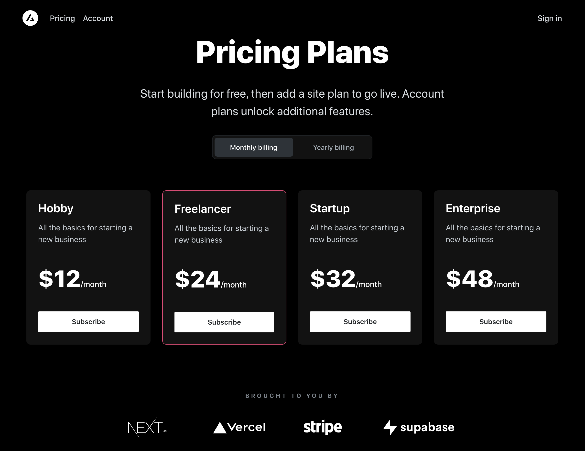

# MindPlexa

An AI-powered infinite canvas where you type a concept and get a visual diagram. Built with Next.js, React Flow, Supabase, and Stripe.

**Live site:** [mind-plexa.vercel.app/home](https://mind-plexa.vercel.app/home)



## What it does

You type something like "Create a book outline about stoicism" and the AI generates a structured diagram with connected nodes on an infinite canvas. You can drag, resize, connect, and edit the nodes. It supports multiple AI models (GPT-4o and Claude).

There are 5 node types:

- **Note** - rich text editor (Quill.js)
- **Task** - actionable items with status tracking
- **Table** - embedded data table (AG Grid)
- **Calendar** - scheduling (React Big Calendar)
- **Draw** - freehand drawing

## Tech stack

- **Next.js 14** (App Router) for the framework
- **React Flow** for the infinite canvas
- **Zustand** for state management (split into 4 domain stores)
- **Supabase** for database, auth, and row-level security
- **Stripe** for payments (webhook sync to Supabase)
- **Tailwind CSS + Framer Motion** for styling
- **Vercel** for deployment

## Architecture

```
Next.js 14 App
|
|-- /home           Landing page
|-- /workspace      User dashboard
|-- /canvasEditor   React Flow canvas (the core)
|
|-- Zustand Stores
|   |-- useNodeStore
|   |-- useEdgeStore
|   |-- useCanvasStore
|   |-- useUIStore
|
|-- /api/completion  AI endpoint (Edge Runtime, OpenAI + Claude)
|-- Supabase         nodes, edges, canvases, users, subscriptions
```

State is split by domain on purpose. Node operations, edge operations, canvas metadata, and UI state each live in their own store so the canvas doesn't choke on re-renders when you have hundreds of nodes.

## Getting started

### What you need
- Node.js 18+
- [Supabase](https://supabase.com) account (free tier works)
- [OpenAI](https://platform.openai.com) or [Anthropic](https://console.anthropic.com) API key
- [Stripe](https://stripe.com) account (test mode)

### Setup

```bash
git clone https://github.com/jayasth/MindPlexa.git
cd MindPlexa
npm install
cp .env.example .env.local
# fill in your keys in .env.local
```

Set up Supabase by creating a project and running `schema.sql` in the SQL editor.

```bash
npm run dev
```

Open http://localhost:3000. Sign up to get to the canvas.

## The backstory

I built this solo over 9 months in 2024. The original idea was simple: type a concept, see it as a mind map. Then I kept adding features. Notes, tasks, tables, calendars, drawing, multiple AI models, Stripe billing, analytics. A 30-day MVP turned into a 9-month project.

It launched to zero traction. No audience, no marketing plan. Just me, building.

MindPlexa made $0. But I learned more building it than in any course or tutorial. I'm open-sourcing it because the code might be useful to someone, and because keeping it in a private repo helps nobody.

**Lessons learned:**
- Ship small. Iterate. Don't build for 9 months in silence.
- Distribution matters more than features.
- A working codebase has value even when the business doesn't.

## Contributing

See [CONTRIBUTING.md](CONTRIBUTING.md) for setup and guidelines.

Things that would help:
- Upgrading to Next.js 15 / React 19 / latest React Flow
- Adding Docker Compose for local development
- Writing tests (jest is configured, specs are not)
- Improving mobile support

## License

[MIT](LICENSE)

## Author

Built by **Jayasth**

- [LinkedIn](https://linkedin.com/in/jayasth) *(update with your real URL)*
- Available for consulting and contract work
